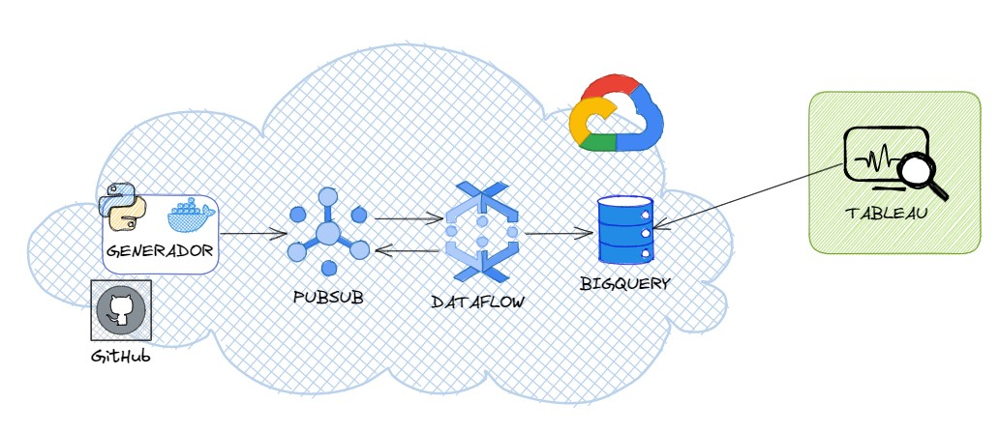

# Data Project 2

## Segundo Data Project del máster Data Analytics

---

Equipo:

- Javier Figueroa
- Francisco Conejero
- Alejandro Martí
- Jorge Arce
- Claudia Darás

## Descripción del proyecto
---

- **Caso de Estudio**: Se trata de simular el uso de dispositivos IoT, que ne nuestro caso se trata de coches inteligentes que monitorizan al conductor con la finalidad de detectar a tiempo si se esta durmiendo al volante o no.
- **Objetivo**: Crear una infraestructura capaz de simular datos de los vehículos y transformarlos para poder detectar la somnolencia.
- **Supuestos**: Tenemos 3 tipos de sensores monitorizanod en el vehículo:
    
    1. Volante: que nos proporciona datos de las pulsaciones y tensión arterial.
    2. Cámara: que nos informa de que grado de inclinación tiene la cabeza del conductor y cuantas veces parpadea en un tiempo determinado.
    3. Centralita del coche: nos informa del tiempo de conducción, si el conductor está teniendo cambios bruscos de velocidad o si hace muchas correcciones al volante.

## Diseño de la arquitectura
---

Como se aprecia en la imagne, para probar este proyecto será necesario tener una cuenta en **Google Cloud Platform**, tener creados 2 tópicos en PubuSub `vehiculo` y `alarma`. Además se tendrá que tener un dataset, donde no hará falta crear tablas, porque es el propio código quien las genera. Imprescindible también tener habilitado `Dataflow API`.

## Estructura del proyecto
---

Este proyecto se compone de dos carpetas principales. 

1. Vehicle_generator: donde se encuentra el código que simula los vehiculos que nos van a enviar los datos. Dentro de esta encontramos otra carpeta *vehicle* que contiene el código que genera los datos de un vehículo. En el archivo *README* de esta carpeta se encuentra más detalle de como funciona esta generación de datos.

2. DataFlow: donde se encuentra el código para poder tratar los datos que consumimos del tópico de pubsub donde van dejando todos los mensajes los vehículos. Se encarga de guardarlos en un base de datos, a parte de filtrar los que consideramos como alarmas de somnolencia. También, tiene un tratamiento a cada minuto para emitir otro tipo de alerta más grave cuando detectamos que un conductor tiene más de 3 alarmas en ese periodo de un minuto.

## Demostración del funcionamiento:

[Video de demostración](https://www.youtube.com/watch?v=OYXNEm5Nvxs&t=77s)